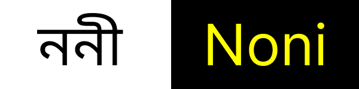

## Noni (WIP)



A minimal tensor library with autograd flexible for building good enough deep learning models.

### Familiar API

```python
a = Tensor([[1., 2.], [3., 4.]], requires_grad=True)
b = Tensor([[0.5, -1.], [2., 0.]], requires_grad=True)

# Each op records its backward function
c = a * b        # op="*",  backward: dc/da = b, dc/db = a
d = c.sum()      # op="sum", backward: ones

d.backward()     # topological sort → apply each _backward in reverse

print(a.grad)    # dL/da = b.data = [[0.5, -1.], [2., 0.]]
print(b.grad)    # dL/db = a.data = [[1., 2.], [3., 4.]]
```

### Common Modules for everything

```python
from noni.nn import Linear, LayerNorm, MultiHeadAttention, CrossEntropyLoss

# A simple 2-layer MLP
W1 = Linear(784, 256)
W2 = Linear(256, 10)

x = Tensor(some_batch)
h = W1(x).relu()
logits = W2(h)

loss = CrossEntropyLoss()(logits, targets)
loss.backward()   # gradients in W1.weight.grad, W2.weight.grad etc.
```

| Module                 | Description                                                                                   |
| ---------------------- | --------------------------------------------------------------------------------------------- |
| **Linear**             | Fully connected layer with weight + bias parameters, initialized using Kaiming initialization |
| **Embedding**          | Lookup table for token embeddings with scatter-add backward pass                              |
| **LayerNorm**          | Normalizes across the last N dimensions with learned affine parameters                        |
| **Dropout**            | Inverted dropout applied during training for regularization                                   |
| **MultiHeadAttention** | Multi-head self-attention module with optional causal mask for autoregressive models          |
| **FeedForward**        | Position-wise feedforward network using GELU activation                                       |
| **TransformerBlock**   | Pre-norm residual block combining Multi-Head Attention and FeedForward layers                 |
| **CrossEntropyLoss**   | Numerically stable implementation using log-softmax + negative log likelihood                 |
| **Optimizers**         | Includes SGD, Adam, AdamW, and CosineAnnealingLR scheduler                                    |
